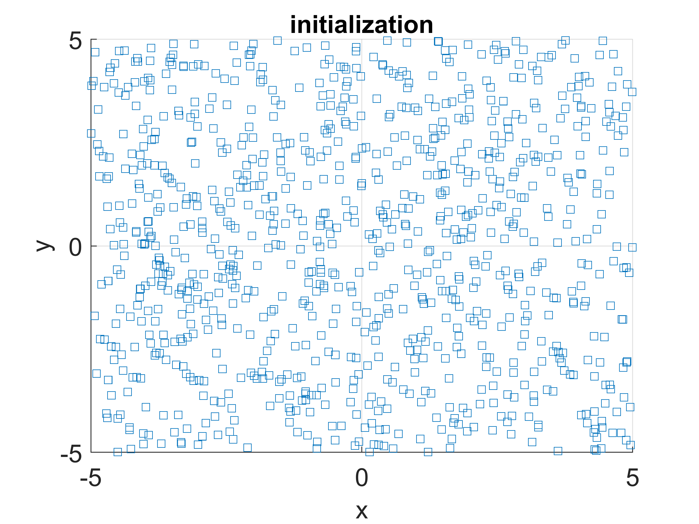
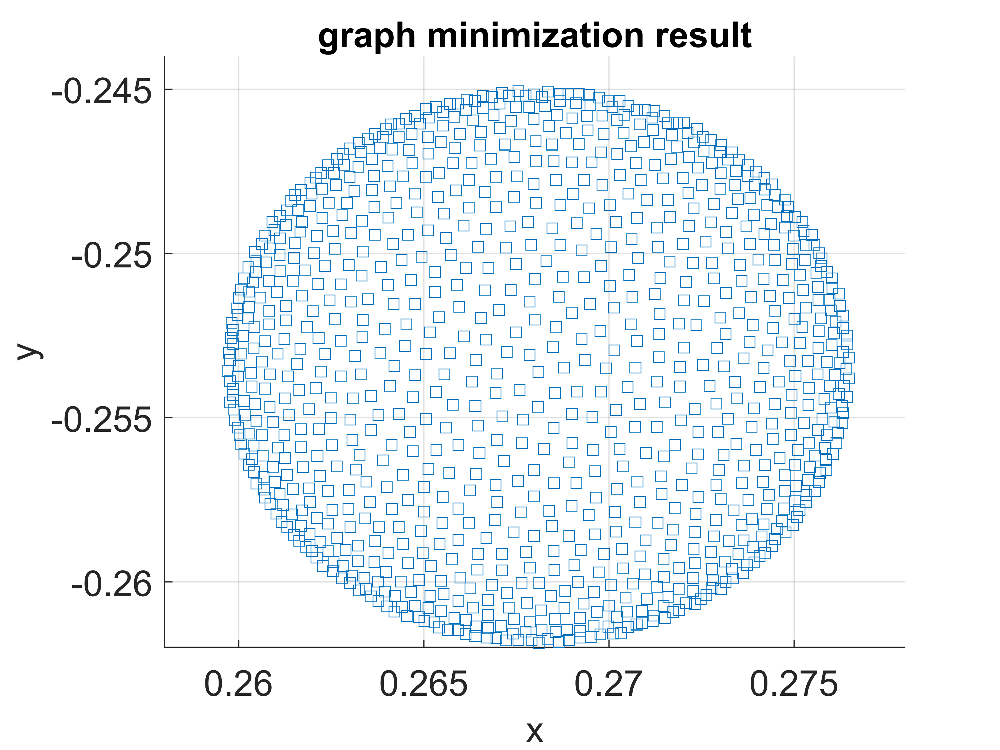

# graph_energy_minimization

implementation of a method of doing graph minimization.
The idea here is to model the graph with repulsive force and attractive forse and further model their corresponding energy.
Use the combined force to guide the graph movement and iterate this process until the condition is met.

iterative non heuristic way of doing graph minimization. No way to escape the local minimum.
I found this solution by one paper published at IPIN2018 by someone from university of Minho. They used this method to do a very 
similar graph slam in order to build the fingerprint map for bluetooth signal.

However, I don't think this is the best way to do graph minimization.
But some some scale problem can be modeled as graph minimization problem and solve with this method.

demo:

